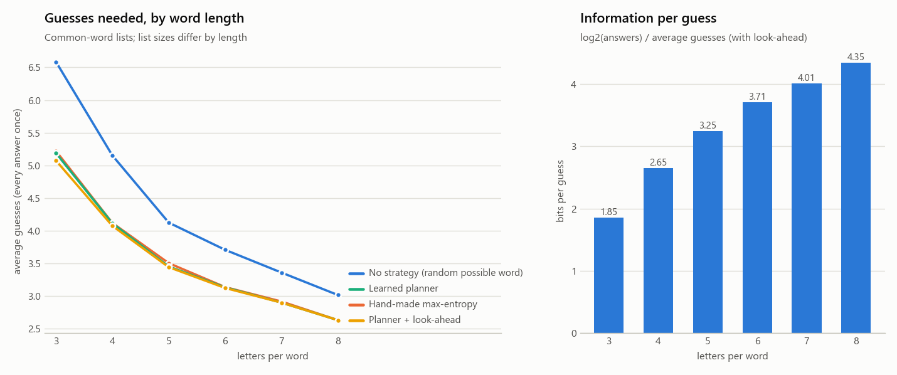

# WordleML

A terminal Wordle clone, AIs that get better at Wordle by playing it, a live
dashboard to watch them learn, and a benchmark that produces citable numbers.

## Quick start

```
pip install -r requirements.txt
python dashboard.py                    # watch the AI train live in your browser
python dashboard.py --length 7         # ...on 7-letter words (the page has a slider for this)
python benchmark.py                    # reproducible report in reports/<date-time>/ (~10 min)
python benchmark.py --length-study     # how word length (3-8 letters) changes the game (~10 min)
python play.py [--length 6]            # play Wordle yourself
python play.py --watch [--lookahead]   # watch the trained AI play, with its top choices
python evaluate.py [--lookahead]       # score the trained AI on every answer word
pytest                                 # run the tests
```

`--length L` (3–8) switches to the common-word list of that length; `--common` uses the
common-word list at 5 letters instead of the official Wordle list.

## The AIs

Both know the rules. They keep track of which of the 2,315 answers still match
the colors, and say the answer once only one is left. Games have no guess limit:
they continue until the word is found. Each practice game uses a random secret.

**"Any valid word" (the main AI, a planner).**
- It may guess any of the 12,972 valid words, including *probe* words that can't be the answer but test several letters at once.
- It can work out how any guess would split the words that are still possible.
- What it learns from its own games is one curve, *V(m)*: how many more guesses it usually needs when *m* words are possible. That's 3 learned numbers.
- It plays the guess with the lowest expected cost. Winning right away costs 0; otherwise the cost is the average *V* of the leftover groups.
- A blank AI (V = 0) thinks every guess is equally good, so it plays random words.
- Nobody tells it when to probe or when to go for the win. Both come out of the sum, which means your strategies emerge on their own:
  - A weak opener is followed by fresh common letters.
  - _IGHT with many options → play a word that tests several first letters.
  - With 2 words left → go for the win.

**"Only words that could be the answer".**
- It can never probe.
- It learns 3 weights on word facts with REINFORCE (policy gradient).
- It plateaus around 3.6 guesses, because probing is exactly what it's missing.

**Look-ahead (thinking longer at test time).**
- The planner looks one guess ahead and judges what's left only by *how many* words remain. That's what keeps it ~0.02 above the optimum.
- With look-ahead, it takes its 10 favorite guesses each turn and works out, exactly, how many more guesses each would cost if it kept playing its normal way afterwards, averaged over every word that's still possible. Then it plays the best one.
- This is *rollout*, the method Bhambri, Bhattacharjee & Bertsekas used to get near-optimal. It can never be worse than the planner it builds on, it has no randomness, and it learns nothing new: practice stays one-step and fast.
- Use it with `evaluate.py --lookahead`, `play.py --watch --lookahead`, or the dashboard's "Exam with look-ahead" button.

## The dashboard

`python dashboard.py` opens http://127.0.0.1:8765. It has:

- **Controls:** Pause, Continue, Reset (a blank AI at game 0), a "Guesses allowed" mode selector, "Games to train", and speed.
- **Word length:** a slider from 3 to 8 letters. At 5 there's an "Official Wordle list" checkbox (on by default). Changing either prepares that word list in the background (the first time, 7–8 letters take up to ~1 min to build their pattern table), then starts a fresh AI. Each word list keeps its own saved model.
- **Skill check:** every 10 games at first, then every ~25, it plays the same 100 words with its best guesses, so luck can't move the curve.
- **Final exam:** when the run ends, it plays every answer word once. On the official list, that's the number to compare with the proven optimum of 3.4201; other lists have no published optimum.
- **Exam with look-ahead:** the same exam with look-ahead, run in the background (~5–25 s, depending on the list).
- **What it has learned:** the V(m) curve, or the weights in "possible" mode.
- **What it learned to do:** how often it probes, by how many words were left; the latest probe it made; and whether it follows a weak opener with fresh letters.
- **Openers it tried:** with averages, plus how many games trial and error would need to tell openers apart.
- **Word difficulty:** look up any word (`/?word=foyer`), or analyze all 2,315.

## Benchmark and results

`python benchmark.py` plays every one of the 2,315 answers once with every strategy, using
best guesses and fixed tie-breaks, so no score depends on luck. Learners are trained from
scratch over several seeds, and results are the mean ± 95% CI across seeds. It writes
`report.md`, the charts, CSVs and `config.json` (seeds, settings, file hashes) to
`reports/<date-time>/`. `--quick` does a fast smoke test on a word subset; don't cite it.

Results from the full run in `reports/2026-09-28_135727/` (all 2,315 answers; 10 seeds for
learners unless noted):

| Strategy | Average guesses | Worst |
|---|---|---|
| No strategy: random word that could be the answer (5 seeds) | 4.104 ± 0.017 | 9 |
| Blank planner: random valid words | 5.263 | 10 |
| Policy gradient, only possible words | 3.609 ± 0.013 | 8 |
| Policy gradient, any word (5 seeds) | 3.495 ± 0.001 | 5 |
| Hand-made: most information (max entropy) | 3.463 | 6 |
| **Learned planner (500 practice games)** | **3.438 ± 0.001** | 6 |
| Learned planner + look-ahead, top 5 guesses per turn | 3.4276 | 6 |
| **Learned planner + look-ahead, top 10 guesses per turn** | **3.4246** | 5 |
| Proven optimum (literature) | 3.4201 | 5 |

- **Near-optimal:** the learned planner is 0.52% above the proven optimum. It gets within 0.05 guesses of its final skill after one practice game.
- **Look-ahead closes three quarters of the gap:** 3.4246 is +0.0045 (0.13%) above the proven optimum, with CRATE as the opener. It takes ~15 s for all 2,315 words. Width 20 is no better than 10.
  - It thinks ahead again on every turn. What's left of the gap comes from two limits: it only weighs the planner's top 10 guesses, and it scores each one as if the *plain* planner played on afterwards.
  - Going further would mean scoring candidates with look-ahead playing on (a second rollout level), roughly 10× the thinking time.
- **Probing emerges:** with 2 words left it never probes; with 6–20 left it probes 56% of the time, and with 21+ left, 96%. For NIGHT it plays REAST → LOGIN, a word that can't win, and that narrows the 35 candidates to 1.
- **Openers:** it picks REAST on its own. Scored exactly, with its own follow-up play, CRATE (3.433) and SALET (3.434) would be slightly better. Telling a 0.05-guess difference apart by trial and error would take ~2,700 games per opener, which is why openers are scored exactly.
- **What makes words hard (for this AI):** how much the opener narrows them down (+0.17 guesses per halving of the words left) and big one-letter look-alike families (CATCH/HATCH/MATCH…, +0.04 per look-alike). Repeated letters and rare letters show no clear effect once those are accounted for. Together these explain ~26% of the difference between words.
- **Published results:** exact optimum 3.4201 with SALET (Bertsimas & Paskov 2022; Selby 2022); hard mode ≈ 3.5076; deep RL ≈ 3.9 after hundreds of thousands of games (Ho); rollout RL near-optimal (Bhambri et al., arXiv:2211.10298). The benchmark report lists them with links.

## How word length changes the game

`python benchmark.py --length-study` runs the same experiment for 3 to 8 letters, on the common-word
lists (see *Word lists* below). For each length, it trains the planner from scratch several times and
plays every answer once with each strategy. It writes `report.md`, `length_study.csv` and
`length_study.png` to `reports/<date-time>_lengths/`.

Results from `reports/2026-09-28_134753_lengths/` (every answer once; planner: 5 training runs of
300 games per length, ± = 95% CI; no strategy: 5 seeds):

| Letters | Answers | Allowed guesses | No strategy | Max entropy | Learned planner | + look-ahead | Bits per guess |
|---|---|---|---|---|---|---|---|
| 3 | 669 | 972 | 6.585 ± 0.068 | 5.220 | 5.187 ± 0.050 | **5.073** | 1.85 |
| 4 | 1,759 | 3,903 | 5.152 ± 0.039 | 4.118 | 4.113 ± 0.000 | **4.074** | 2.65 |
| 5 | 2,315 | 8,636 | 4.123 ± 0.022 | 3.503 | 3.452 ± 0.002 | **3.441** | 3.25 |
| 6 | 3,087 | 15,000 | 3.707 ± 0.020 | 3.136 | 3.132 ± 0.007 | **3.122** | 3.71 |
| 7 | 3,152 | 15,000 | 3.358 ± 0.027 | 2.916 | 2.899 ± 0.000 | **2.898** | 4.01 |
| 8 | 2,768 | 15,000 | 3.015 ± 0.020 | 2.630 | 2.630 ± 0.001 | **2.630** | 4.35 |



- **Longer words are much easier:** 5.07 guesses at 3 letters, 2.63 at 8. That's not because of list size; 3 letters has the *fewest* answers.
- **Each guess tells you more:** bits per guess = log2(answers) / average guesses, i.e. how many times each guess halves the list. It rises from 1.85 to 4.35, because every guess tests more letters at once.
- **Strategy matters most for short words:**
  - The gap between no strategy and the best play shrinks from 1.51 guesses at 3 letters to 0.39 at 8.
  - The gap between max entropy and look-ahead shrinks from 0.15 to 0.
  - At 3 letters, even the best first guess (TAE) leaves ~139 of the 669 answers on average. Short words come in big look-alike families (BAT/CAT/HAT/MAT/…), so choosing the right probe pays off.
  - At 8 letters, the best first guess leaves ~6 of 2,768, and even the 100th-best leaves ~9. With so little left after one guess, there's little to plan.
- **The worst cases follow the same pattern:** 9 guesses at 3 letters even with look-ahead, 4 at 8 letters.
- **The official list is not the same game:** the common 5-letter list has the same number of answers (2,315) but only 8,636 allowed guesses against 12,972, and different words. Look-ahead scores 3.441 on it and 3.4246 on the official list. Compare lengths using the common lists only.

## Layout

```
wordle/     game rules + scoring, word sets and list builder, the precomputed pattern tables, terminal colors
agents/     planner (planning_agent.py), look-ahead (lookahead.py), policy-gradient learner
            (learning_agent.py), facts, baselines
analysis/   word difficulty, hand-made strategies, statistics, benchmark tasks, length study, report charts
live/       dashboard: training session, web server, page
dashboard.py, benchmark.py, play.py, evaluate.py
data/       answers.txt + allowed_guesses.txt (official Wordle lists), lists/ (common-word lists, 3-8
            letters), sources/ (what they're built from), patterns*.npz (built on first use)
models/     agent.npz (official list) and agent_common{L}.npz, saved by the dashboard
```

## Word lists and credits

- `data/answers.txt` and `data/allowed_guesses.txt` are the official Wordle lists (2,315 answers, 12,972 allowed guesses).
- The common-word lists for 3–8 letters (`data/lists/`) are built by `python -m wordle.wordlists`, using the same recipe for every length:
  - **Answers:** words in the ENABLE dictionary (public domain) that are among the ~32,000 most frequent English words in [FrequencyWords](https://github.com/hermitdave/FrequencyWords) (CC BY-SA 4.0), with simple plurals dropped.
  - **Allowed guesses:** every ENABLE word of that length, up to 15,000.
  - The frequency cutoff is set so that 5 letters gives 2,315 answers, as many as the official list (not the same words); other lengths get however many words pass that same cutoff.
  - Details are in `data/sources/README.md`.
