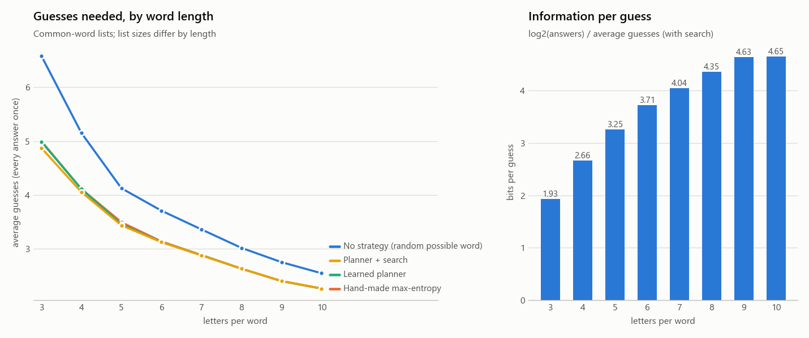

# WordleML

A terminal Wordle clone, AIs that get better at Wordle by playing it, a live
dashboard to watch them learn, and a benchmark that produces citable numbers.

## Quick start

```
pip install -r requirements.txt
python dashboard.py                    # watch the AI train live in your browser
python dashboard.py --length 7         # ...on 7-letter words (the page has a slider for this)
python benchmark.py                    # reproducible report in reports/<date-time>/ (~10 min)
python benchmark.py --length-study     # how word length (3-10 letters) changes the game
python play.py [--length 6]            # play Wordle yourself
python play.py --watch [--lookahead | --search]   # watch the trained AI play, with its top choices
python evaluate.py [--lookahead | --search]       # score the trained AI on every answer word
pytest                                 # run the tests
```

`--length L` (3–10) switches to the common-word list of that length; `--common` uses the
common-word list at 5 letters instead of the official Wordle list.

## The AIs

Both know the rules. They keep track of which of the 2,315 answers still match
the colors, and say the answer once only one is left. Games have no guess limit:
they continue until the word is found. Each practice game uses a random secret.

**"Any valid word" (the main AI, a planner).**
- It may guess any of the 12,972 valid words, including *probe* words that can't be the answer but test several letters at once.
- It can work out how any guess would split the words that are still possible.
- What it learns from its own games is one curve, *V(m)*: how many more guesses it usually needs when *m* words are possible. That's 3 learned numbers.
- It plays the guess with the lowest expected cost. Winning right away costs 0; otherwise the cost is the average *V* of the leftover groups.
- A blank AI (V = 0) thinks every guess is equally good, so it plays random words.
- Nobody tells it when to probe or when to go for the win. Both come out of the sum, which means your strategies emerge on their own:
  - A weak opener is followed by fresh common letters.
  - _IGHT with many options → play a word that tests several first letters.
  - With 2 words left → go for the win.

**"Only words that could be the answer".**
- It can never probe.
- It learns 3 weights on word facts with REINFORCE (policy gradient).
- It plateaus around 3.6 guesses, because probing is exactly what it's missing.

**Look-ahead (thinking longer at test time).**
- The planner looks one guess ahead and judges what's left only by *how many* words remain. That's what keeps it ~0.02 above the optimum.
- With look-ahead, it takes its 10 favorite guesses each turn and works out, exactly, how many more guesses each would cost if it kept playing its normal way afterwards, averaged over every word that's still possible. Then it plays the best one.
- This is *rollout*, the method Bhambri, Bhattacharjee & Bertsekas used to get near-optimal. It can never be worse than the planner it builds on, it has no randomness, and it learns nothing new: practice stays one-step and fast.
- Use it with `evaluate.py --lookahead`, `play.py --watch --lookahead`, or the dashboard's "Exam with look-ahead" button.

**Search: perfect play on the official list.**
- At every position it takes the planner's 20 favourite guesses and works out *exactly* how many guesses each one leads to, all the way to the end of every game, then keeps the best. The planner decides where to look; the search decides.
- It's exact within those candidates. Lower bounds and branch-and-bound skip guesses that provably can't win, and every solved position is remembered.
- On the official list it plays all 2,315 words in **7,920 guesses in total = 3.4212 on average, the proven optimum**, in about 75 s. It picks the opener SALET by itself, the one Selby proved best.
- That's as low as any strategy can go: the optimum was proven by exhaustive search, so it can be matched but not beaten. A lower number would mean a bug in the scoring.
- Use it with `evaluate.py --search [WIDTH]` (it saves the whole plan to `models/search_wordle5.json`), `play.py --watch --search` (replays the plan instantly), or the dashboard's "Exam with search" button.

## The dashboard

`python dashboard.py` opens http://127.0.0.1:8765. It has:

- **Controls:** Pause, Continue, Reset (a blank AI at game 0), a "Guesses allowed" mode selector, "Games to train", and speed.
- **Word length:** a slider from 3 to 10 letters. At 5 there's an "Official Wordle list" checkbox (on by default). Changing either prepares that word list in the background (the first time, 7–8 letters take up to ~1 min to build their pattern table), then starts a fresh AI. Each word list keeps its own saved model.
- **Skill check:** every 10 games at first, then every ~25, it plays the same 100 words with its best guesses, so luck can't move the curve.
- **Final exam:** when the run ends, it plays every answer word once. On the official list it's shown as a total too, next to the proven optimum of 7,920 guesses (3.4212); other lists have no published optimum.
- **Exam with look-ahead:** the same exam with look-ahead, run in the background (seconds).
- **Exam with search:** the same exam with the full search, run in a separate process so training isn't slowed (about a minute on the official list; longer on 3–4 letter words), with live progress.
- **What it has learned:** the V(m) curve, or the weights in "possible" mode.
- **What it learned to do:** how often it probes, by how many words were left; the latest probe it made; and whether it follows a weak opener with fresh letters.
- **Openers it tried:** with averages, plus how many games trial and error would need to tell openers apart.
- **Word difficulty:** look up any word (`/?word=foyer`), or analyze all 2,315.

## Benchmark and results

`python benchmark.py` plays every one of the 2,315 answers once with every strategy, using
best guesses and fixed tie-breaks, so no score depends on luck. Learners are trained from
scratch over several seeds, and results are the mean ± 95% CI across seeds. It writes
`report.md`, the charts, CSVs and `config.json` (seeds, settings, file hashes) to
`reports/<date-time>/`. `--quick` does a fast smoke test on a word subset; don't cite it.

Results from the full run in `reports/2026-09-28_180842/` (all 2,315 answers; 10 seeds for
learners unless noted). Totals are exact: the number of guesses to play every answer once.

| Strategy | Average guesses | Total | Worst |
|---|---|---|---|
| No strategy: random word that could be the answer (5 seeds) | 4.104 ± 0.017 | | 9 |
| Blank planner: random valid words | 5.263 | 12,183 | 10 |
| Policy gradient, only possible words | 3.609 ± 0.013 | | 8 |
| Policy gradient, any word (5 seeds) | 3.495 ± 0.001 | | 5 |
| Hand-made: most information (max entropy) | 3.4635 | 8,018 | 6 |
| **Learned planner (500 practice games)** | **3.438 ± 0.001** | | 6 |
| Learned planner + look-ahead, top 10 guesses per turn | 3.4246 | 7,928 | 5 |
| Learned planner + search, top 3 guesses per position | 3.4259 | 7,931 | 6 |
| Learned planner + search, top 5 guesses per position | 3.4233 | 7,925 | 6 |
| **Learned planner + search, top 10 guesses per position** | **3.4212** | **7,920** | 5 |
| Proven optimum (Selby 2022) | 3.4212 | 7,920 | 5 |

- **Perfect play:** with search (the planner's top 10 guesses at every position, worked out exactly) the AI plays all 2,315 words in 7,920 guesses, exactly the proven optimum, in 34 s. With 20 per position it's also 7,920 (60 s). It chose SALET as its opener, the one Selby proved best.
- **Why not lower?** The optimum is a mathematical minimum, proven by exhaustive search: no strategy can average fewer than 3.4212 on these lists. The search is checked against it: for the openers Selby scored individually it never goes below his proven totals (CRATE: 7,927 vs his proven 7,926; SALET: 7,920 = 7,920).
- **About 3.4201:** that often-quoted figure (and 3.5076 in hard mode) is the optimum for the NYT's later list of 2,309 answers, after six words were removed. This project plays the original 2,315-answer list, whose optimum is 3.4212 (hard mode 3.5084). Earlier versions of this README compared against 3.4201 by mistake.
- **The learned planner alone** is +0.017 guesses (0.49%) above perfect play. It gets within 0.05 guesses of its final skill after one practice game.
- **Look-ahead** gets to 7,928 total (3.4246) in ~15 s, 8 guesses short of perfect over all 2,315 games. It scores each candidate as if the plain planner played on afterwards; the search removes that limit.
- **Probing emerges:** with 2 words left it never probes; with 6–20 left it probes 56% of the time, and with 21+ left, 96%. For NIGHT it plays REAST → LOGIN, a word that can't win, and that narrows the 35 candidates to 1.
- **Openers:** it picks REAST on its own. Scored exactly, with its own follow-up play, CRATE (3.433) and SALET (3.434) would be slightly better. Telling a 0.05-guess difference apart by trial and error would take ~2,700 games per opener, which is why openers are scored exactly.
- **What makes words hard (for this AI):** how much the opener narrows them down (+0.17 guesses per halving of the words left) and big one-letter look-alike families (CATCH/HATCH/MATCH…, +0.04 per look-alike). Repeated letters and rare letters show no clear effect once those are accounted for. Together these explain ~26% of the difference between words.
- **Published results:** exact optimum 7,920 guesses (3.4212) with SALET on the original lists (Selby 2022; Bertsimas & Paskov 2022); hard mode 3.5084; deep RL ≈ 3.9 after hundreds of thousands of games (Ho); rollout RL near-optimal (Bhambri et al., arXiv:2211.10298). The benchmark report lists them with links.

## How word length changes the game

`python benchmark.py --length-study` runs the same experiment for 3 to 10 letters, on the common-word
lists (see *Word lists* below). For each length, it trains the planner from scratch several times and
plays every answer once with each strategy, including look-ahead and search. It writes `report.md`,
`length_study.csv` and `length_study.png` to `reports/<date-time>_lengths/` (~30 min).

Results from `reports/2026-09-28_182132_lengths/` (every answer once; planner: 5 training runs of
300 games per length, ± = 95% CI; no strategy: 5 seeds; search: the planner's top 20 guesses at every
position):

| Letters | Answers | Allowed guesses | No strategy | Max entropy | Learned planner | + look-ahead | + search (total) | Bits per guess |
|---|---|---|---|---|---|---|---|---|
| 3 | 669 | 1,346 | 6.585 ± 0.068 | 5.001 | 4.989 ± 0.001 | 4.900 | **4.873** (3,260) | 1.93 |
| 4 | 1,759 | 4,545 | 5.152 ± 0.039 | 4.111 | 4.109 ± 0.002 | 4.060 | **4.053** (7,130) | 2.66 |
| 5 | 2,315 | 13,314 | 4.123 ± 0.022 | 3.492 | 3.454 ± 0.024 | 3.435 | **3.435** (7,952) | 3.25 |
| 6 | 3,087 | 16,712 | 3.707 ± 0.020 | 3.136 | 3.124 ± 0.000 | 3.121 | **3.121** (9,635) | 3.71 |
| 7 | 3,152 | 25,276 | 3.358 ± 0.027 | 2.881 | 2.881 ± 0.001 | 2.875 | **2.875** (9,062) | 4.04 |
| 8 | 2,768 | 31,425 | 3.015 ± 0.020 | 2.629 | 2.629 ± 0.000 | 2.629 | **2.629** (7,277) | 4.35 |
| 9 | 2,207 | 29,644 | 2.750 ± 0.013 | 2.399 | 2.399 ± 0.000 | 2.399 | **2.399** (5,294) | 4.63 |
| 10 | 1,456 | 25,627 | 2.544 ± 0.022 | 2.260 | 2.260 ± 0.000 | 2.260 | **2.260** (3,290) | 4.65 |



- **Longer words are much easier:** 4.87 guesses at 3 letters, 2.26 at 10. That's not because of list size: 3 letters has the *fewest* answers.
- **Each guess tells you more:** bits per guess = log2(answers) / average guesses, i.e. how many times each guess halves the list. It rises from 1.93 at 3 letters to 4.65 at 10, flattening out at 9–10.
- **Strategy matters most for short words:**
  - The gap between no strategy and the best play shrinks from 1.71 guesses at 3 letters to 0.28 at 10.
  - Search beats look-ahead only at 3 and 4 letters (by 18 and 11 guesses in total). From 5 letters up, look-ahead's plan is already as good as the best the search finds among the planner's top 20 guesses.
  - From 8 letters up, even the hand-made max-entropy rule plays as well as search.
  - At 3 letters, the best first guess (TAE) still leaves ~139 of the 669 answers on average, and big look-alike families (BAT/CAT/HAT/MAT/…) make the right probe pay off. At 8 letters the best first guess leaves ~6 of 2,768, and at 10 letters ~2 of 1,456.
- **No published optimum for these lists:** the search totals are the best results known for them (upper bounds). Only the official list has a proven optimum.
- **The official list is not the same game:** the common 5-letter list has the same number of answers (2,315) but different words and a different guess list; search scores 3.435 on it and 3.4212 (perfect play) on the official list. Compare lengths using the common lists only.

## Layout

```
wordle/     game rules + scoring, word sets and list builder, the precomputed pattern tables, terminal colors
agents/     planner (planning_agent.py), look-ahead (lookahead.py), search (search.py),
            policy-gradient learner (learning_agent.py), facts, baselines
analysis/   word difficulty, hand-made strategies, statistics, benchmark tasks, length study, report charts
live/       dashboard: training session, web server, page
dashboard.py, benchmark.py, play.py, evaluate.py
data/       answers.txt + allowed_guesses.txt (official Wordle lists), lists/ (common-word lists, 3-10
            letters), sources/ (what they're built from), patterns*.npz (built on first use)
models/     agent.npz (official list) and agent_common{L}.npz, saved by the dashboard;
            search_wordle5.json, the searched plan (every answer's guesses) saved by evaluate.py --search
```

## Word lists and credits

- `data/answers.txt` and `data/allowed_guesses.txt` are the official Wordle lists (2,315 answers, 12,972 allowed guesses).
- The common-word lists for 3–10 letters (`data/lists/`) are built by `python -m wordle.wordlists`, using the same recipe for every length:
  - **Answers:** words in the ENABLE dictionary (public domain) that are among the ~32,000 most frequent English words in [FrequencyWords](https://github.com/hermitdave/FrequencyWords) (CC BY-SA 4.0), with simple plurals dropped.
  - **Allowed guesses:** every dictionary word of that length: ENABLE + [SCOWL](https://wordlist.aspell.net/) size 80 ("all the strange and unusual words people like to use in word games such as Scrabble", MIT-like license) + the official Wordle list at 5 letters. That's 1,346 guesses at 3 letters up to 31,425 at 8.
  - The frequency cutoff is set so that 5 letters gives 2,315 answers, as many as the official list (not the same words); other lengths get however many words pass that same cutoff.
  - There's no single official English dictionary. The official Scrabble ones (Collins, NWL) are copyrighted and not published for download, so these freely licensed lists stand in for them (70–100% of their size per length).
  - Where each list came from, and its license, is in `data/sources/README.md`.
