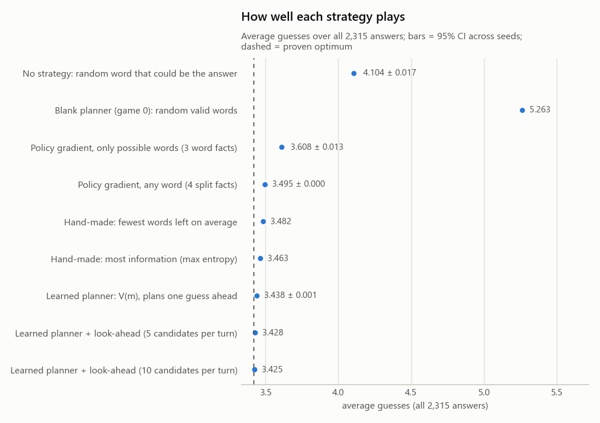
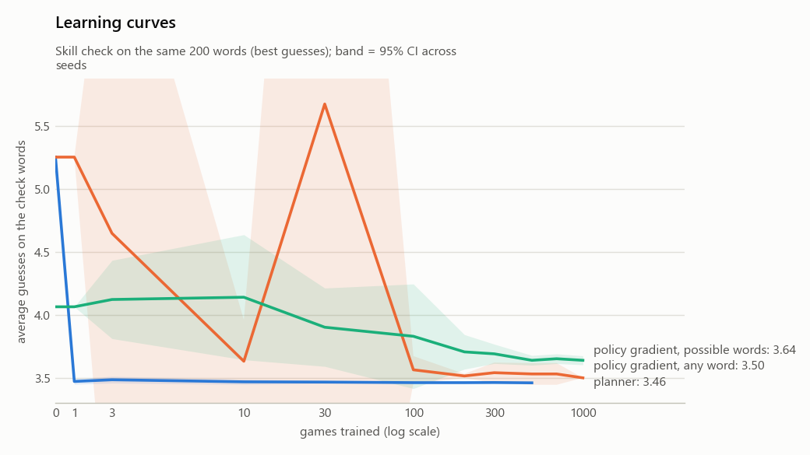
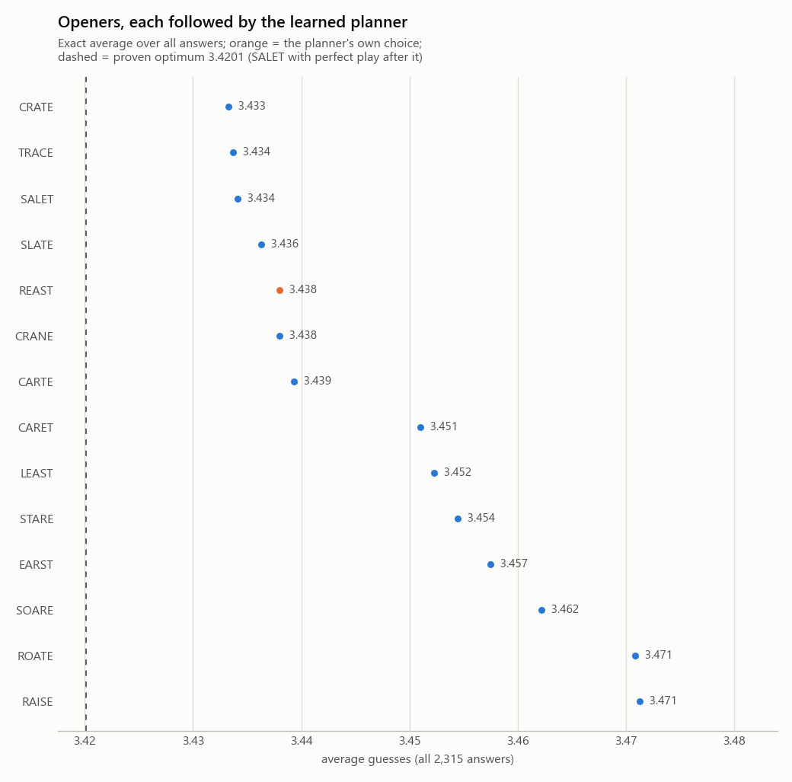
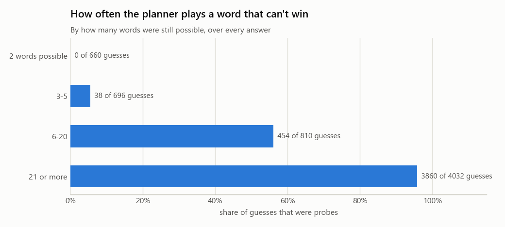

# WordleML benchmark report

Generated 2026-09-28 14:05 in 8 minutes (full run). Every number here can be regenerated with `python benchmark.py`; settings, seeds and file hashes are in `config.json`.

## Headline

- A planner that learns one 3-number curve from its own games (how many more guesses it needs with m words still possible) and plans one guess ahead averages **3.4380 ± 0.0008** guesses over all 2,315 answers (10 independent training runs of 500 games each).
- The proven optimum is **3.4201** (any valid guess allowed; Bertsimas & Paskov 2022, Selby 2022), so the learned planner is **+0.0179 guesses (+0.52%)** from perfect play. Worst game over all runs: 6 guesses; 100.00% solved within 6.
- It gets within 0.05 guesses of its final skill after about **1 game** of practice.
- Thinking further ahead at test time (look-ahead: for its top 10 guesses each turn, the exact expected number of guesses if it plays on; opener CRATE) brings the median planner to **3.4246**, **+0.0045 (+0.13%)** from the proven optimum (worst game 5; 0.2 minutes for every answer). Against the same planner without look-ahead: -0.0133 guesses per game, an exact difference: over all the answers it plans for, look-ahead can't do worse than its planner. Treating the answers as a sample of possible words, the 95% bootstrap CI is [-0.0428, +0.0154]: one-guess differences on single words are large next to a 0.01 average, so a new word list could shift it.

## Setup

- Word lists: the original 2,315 possible answers, and 12,972 valid guesses (answers + 10,657 others).
- No guess limit: every game continues until solved; the score is the number of guesses.
- Protocol: each strategy plays every answer exactly once, using its best guess every turn, with fixed tie-breaks, so there is no luck in a score. Learners are trained from scratch with different seeds (each practice game uses a uniformly random secret); ± values are 95% confidence intervals across seeds.
- Learning curves use a fixed set of 200 check words.

## How well each strategy plays

| Strategy | Runs | Average guesses | Worst | Solved within 6 |
|---|---|---|---|---|
| No strategy: random word that could be the answer | 5 | 4.1037 ± 0.0173 | 9 | 98.30% |
| Blank planner (game 0): random valid words | 1 | 5.2626 | 10 | 84.88% |
| Policy gradient, only possible words (3 word facts) | 10 | 3.6084 ± 0.0130 | 8 | 99.43% |
| Policy gradient, any word (4 split facts) | 5 | 3.4949 ± 0.0005 | 5 | 100.00% |
| Hand-made: fewest words left on average | 1 | 3.4816 | 5 | 100.00% |
| Hand-made: most information (max entropy) | 1 | 3.4635 | 6 | 100.00% |
| Learned planner: V(m), plans one guess ahead | 10 | 3.4380 ± 0.0008 | 6 | 100.00% |
| Learned planner + look-ahead (5 candidates per turn) | 1 | 3.4276 | 6 | 100.00% |
| Learned planner + look-ahead (10 candidates per turn) | 1 | 3.4246 | 5 | 100.00% |
| *Proven optimum, any valid guess (literature)* | | *3.4201* | *5* | *100%* |
| *Proven optimum, hard mode (literature)* | | *3.5076* | | |

## Learning curves

These are averages over the 200 check words only, so they can't be compared with the 3.4201 optimum over all 2,315 answers; the table above can.

| Games trained | planner | policy gradient, any word | policy gradient, possible words |
|---|---|---|---|
| 0 | 5.255 ± 0.000 | 5.255 ± 0.000 | 4.065 ± 0.000 |
| 1 | 3.471 ± 0.022 | 5.255 ± 0.000 | 4.065 ± 0.000 |
| 3 | 3.485 ± 0.027 | 4.649 ± 2.933 | 4.123 ± 0.311 |
| 10 | 3.468 ± 0.021 | 3.632 ± 0.329 | 4.141 ± 0.497 |
| 30 | 3.466 ± 0.013 | 5.677 ± 5.905 | 3.903 ± 0.311 |
| 100 | 3.462 ± 0.002 | 3.564 ± 0.109 | 3.830 ± 0.416 |
| 200 | 3.462 ± 0.002 | 3.515 ± 0.017 | 3.707 ± 0.137 |
| 300 | 3.463 ± 0.002 | 3.541 ± 0.081 | 3.691 ± 0.077 |
| 500 | 3.461 ± 0.001 | 3.531 ± 0.086 | 3.639 ± 0.039 |
| 700 |  | 3.531 ± 0.086 | 3.652 ± 0.039 |
| 1000 |  | 3.500 ± 0.000 | 3.639 ± 0.036 |

## Paired comparisons (same answers, planner minus other)

Negative means the planner needs fewer guesses. 95% bootstrap CI over the answers.

| Compared with | Difference in average guesses | 95% CI |
|---|---|---|
| Hand-made: most information (max entropy) | -0.0255 | [-0.0568, +0.0057] |
| Hand-made: fewest words left on average | -0.0437 | [-0.0733, -0.0130] |
| Policy gradient, any word (4 split facts) | -0.0569 | [-0.0849, -0.0282] |
| Policy gradient, only possible words (3 word facts) | -0.1704 | [-0.2062, -0.1349] |
| No strategy: random word that could be the answer | -0.6657 | [-0.6964, -0.6341] |

## Openers

The learned planner's own opener is **REAST**. Below, its first guess is forced to each of its top 10 choices and to openers from the literature; every other guess is the planner's.

| Opener | Average guesses (all answers) | Worst |
|---|---|---|
| CRATE | 3.4333 | 7 |
| TRACE | 3.4337 | 7 |
| SALET | 3.4341 | 6 |
| SLATE | 3.4363 | 7 |
| REAST (its choice) | 3.4380 | 6 |
| CRANE | 3.4380 | 6 |
| CARTE | 3.4393 | 6 |
| CARET | 3.4510 | 6 |
| LEAST | 3.4523 | 7 |
| STARE | 3.4544 | 6 |
| EARST | 3.4575 | 6 |
| SOARE | 3.4622 | 6 |
| ROATE | 3.4708 | 6 |
| RAISE | 3.4713 | 6 |

Why not find the best opener by trial and error? Single games vary with a standard deviation of 0.66 guesses, so telling apart two openers that differ by 0.05 guesses would take about **2,743 games with each** (95% confidence, 80% power), and 17,142 each for a 0.02 difference. Scoring every opener exactly on all answers, as above, removes luck entirely.

## Emergent strategies

Nobody tells the planner when to play a word that can't be the answer (a probe). How often it did, over every answer:

| Words possible before the guess | Probes |
|---|---|
| 2 words possible | 0% (0 of 660 guesses) |
| 3-5 | 5% (38 of 696 guesses) |
| 6-20 | 56% (454 of 810 guesses) |
| 21 or more | 96% (3860 of 4032 guesses) |

Example games (letter families and near-misses):

- **NIGHT**: REAST (probe) -> 35, LOGIN (probe) -> 1, NIGHT -> 1
- **CATCH**: REAST (probe) -> 48, COLIN (probe) -> 2, CATCH -> 1
- **MOUND**: REAST (probe) -> 227, COLIN (probe) -> 9, BUMPH (probe) -> 1, MOUND -> 1
- **SHAVE**: REAST (probe) -> 13, MULCH (probe) -> 4, PUKED (probe) -> 1, SHAVE -> 1
- **FOYER**: REAST (probe) -> 123, PINED (probe) -> 26, BLOCK (probe) -> 6, MOVER -> 1, FOYER -> 1
- **TIGHT**: REAST (probe) -> 35, LOGIN (probe) -> 4, MIGHT -> 3, WIGHT -> 2, FIGHT -> 1, TIGHT -> 1

## What makes a word hard

Played by the median planner; average 3.4380, opener REAST.

| Trait | Harder group | Easier group | Gap |
|---|---|---|---|
| Words still possible after the opener (REAST) | over 150: 3.81 | 10 or fewer: 2.86 | 0.95 |
| How common the letters are | rarest letters (bottom 25%): 3.71 | commonest letters (top 25%): 3.20 | 0.51 |
| One-letter look-alikes | 6 or more: 3.60 | 1-2: 3.37 | 0.23 |
| Repeated letters | has a repeated letter: 3.51 | no repeated letters: 3.40 | 0.11 |

Linear regression of guesses per word on the traits (R² = 0.257; the rest is which colors come up along the way):

| Term | Coefficient | 95% CI |
|---|---|---|
| intercept | +2.5401 | ± 0.2355 |
| repeated letter (0/1) | +0.0420 | ± 0.0499 |
| one-letter look-alikes | +0.0394 | ± 0.0108 |
| log2(words left after opener) | +0.1743 | ± 0.0156 |
| letter commonness | -0.4997 | ± 0.6863 |

## Ablation (planner variants)

| Variant | Average guesses |
|---|---|
| full planner (curved V, forgetting) | 3.4380 ± 0.0008 |
| no forgetting | 3.4380 ± 0.0000 |
| straight-line V (2 numbers) | 3.4756 ± 0.0103 |

## Related work and how to read these numbers

- Exact optimum: 3.4201 average with SALET, proven by exhaustive search (Bertsimas & Paskov, *An Exact and Interpretable Solution to Wordle*, 2022; A. Selby, 2022). Hard mode: about 3.5076. Summary: https://www.poirrier.ca/notes/wordle-optimal/
- Reinforcement learning: rollout methods get near-optimal (Bhambri, Bhattacharjee & Bertsekas, arXiv:2211.10298); a deep RL agent reached about 3.9 guesses after hundreds of thousands of games (A. Ho, https://andrewkho.github.io/wordle-solver/).
- Word difficulty: see arXiv:2305.03502 for a study of which word attributes make Wordle words hard.
- Limits: the planner is told the rules and can compute how any guess splits the remaining answers (one-step lookahead); what it learns is the value curve V(m). The 'split' idea is hand-designed, so the honest claim is sample efficiency and interpretability with a tiny learned model, not learning from raw pixels or letters.
